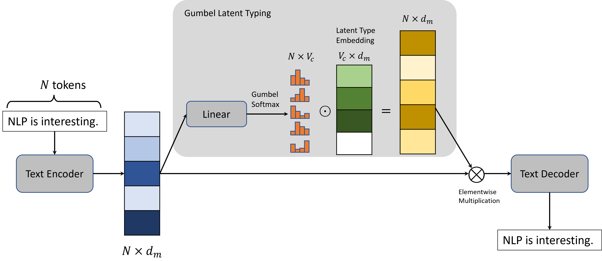

# Language Model Pre-Training with Sparse Latent Typing 

This is the official PyTorch implementation of the paper:
**Language Model Pre-Training with Sparse Latent Typing**. Liliang Ren\*, Zixuan Zhang\*, Han Wang, Clare R. Voss, Chengxiang Zhai, Heng Ji. (\*Equal Contribution) ***EMNLP 2022 (Oral)***
[[paper]](https://arxiv.org/abs/2210.12582) 


## Overview
<p align="center">

</p>

The figure shows the general architecture of our proposed Gumbel Latent Typing module.

Our approach is especially effective for the information extraction related downstream tasks. We push state-of-the-art on the [Few-NERD](https://arxiv.org/abs/2105.07464) benchmark for both the *INTRA* and the *INTER* settings with abolute average F1 improvements of 6.24\% and 3.75\% respectively. We also significantly outperform a strong baseline ([OneIE](https://aclanthology.org/2020.acl-main.713/)) on both the ACE2005 and the ERE dataset (Notably, an absolute improvement of 7.59% on the ERE Entity Extraction subtask) by intializing the parameters of its vanilia `BERT-base` encoder with our `BERT-SparseLT` model continually pretrained from a `BERT-base-uncased` checkpoint using our Sparse Latent Typing objective. 


## Requirements and Installation

The required environment can be installed using the followining command line with the Python version `3.8.12`. 

```
pip install -r requirements.txt
```

## Pretrained Models

We currently released our `BERT-SparseLT` (also denoted as `BERT-SparseLT-VOA`) model, a `BERT-base-uncased` model continually pretrained on the VOA corpus with the Sparse Latent Typing objective for reproducing the results mentioned in our paper. The model checkpoint can be downloaded from [here](https://drive.google.com/file/d/1Clq-VcdMRLnaEpOlV6BS_chMzY0-iO6Z/view?usp=sharing). 

## Data Preparation

To do continual pretraining, you need to first download the VOA corpus from [here](https://drive.google.com/file/d/1IZ633R2IoBAEQ4lOtJ-aPDMPLbAkfZJr/view?usp=sharing) and put it under the `data/` directory. If you also want to evaluate the pretrained model on the few-shot named entity extraction task, please go to the `evaluations/ner/CONTaiNER/` directory and follow the original `CONTaiNER` [repository](https://github.com/psunlpgroup/CONTaiNER) for data preparation.

## Continual Pre-Training

Our `BERT-SparseLT` model can be continually pretrained from the `BERT-base-uncased` checkpoint on a single V100 GPU with 16GB graphical memory using the following command line.

```
python pretrain.py --name bert_base_voa_sparseLT --alpha 0.05 --beta 0.05 --gamma 0.1
```

This will produce and store the checkpoint for the full autoencoder model (includeing the Gumbel Latent Typer) containing the `BERT-SparseLT` encoder as denoted in the paper.

You may use the following code snippet to extract the `BERT-SparseLT` model parameters and use it in the same way as the original `BERT-base-uncased` model for the downstream tasks.

```
python convert_checkpoint.py
```

## Latent Typing and Sentence Reconstruction

After pretraining, you may use the following code snippet to play with the latent typer and the decoder to do sparse latent typing and sentence reconstruction for any input text. The model directory used in the snippet should store the checkpoint of the full autoenocoder model. 

```
python test_generation.py
```

An example of the latent typing and sentence reconstruction result, the tokens that are not selected for typing (classified as the latent type 0) are ignored:

```
INPUT SENTENCE:
Our approach provides the decoder model with a shortcut to directly access the encoded token representations, so that the latent representation for each of the input tokens can be learned as an auxiliary type representation.

LATENT TYPINGS:
our(20), approach(20), provides(48), deco(19), ##der(13), model(27), with(16), short(49), ##cut(61), directly(18), access(48), encoded(25), token(53), representations(6), so(2), that(59), late(49), ##nt(4), representation(22), each(26), input(25), token(53), can(41), learned(38), as(58), auxiliary(32), type(30), representation(53),

OUTPUT SENTENCE:
our approach provides the decoder model with a shortcut to directly access the encoded token representations, so that the latent representation of each of the input tokens can be learned as an auxiliary type representation representation.
```

## Few-shot Evaluation

To reproduce the few-shot results in our paper, please go to the directory `evaluations/ner/CONTaiNER/` and run the following bash script to evaluate our model on the INTRA/INTER settings of the Few-NERD benchmark. We are assuming the model checkpoint is stored in the `checkpoints/for_container/` directory. 

```
NAME=model_LP_100k #random model name
TYPE=intra #change to 'inter' for INTER setting evaluation 
bash exec_container.sh $TYPE 0 5 1 $NAME  #5-way-1-shot
bash exec_container.sh $TYPE 0 5 5 $NAME  #5-way-5-shot
bash exec_container.sh $TYPE 0 10 5 $NAME #10-way-5-shot
bash exec_container.sh $TYPE 0 10 1 $NAME #10-way-1-shot

```

After producing the outputs, you may also collect the evaluation results and calculate the F1 scores using the `calc_micro.sh` script in that directory.


## Citation

If you found this repository helpful, please cite our paper: 

```
@article{ren2022language,
        title={Language Model Pre-Training with Sparse Latent Typing},
        author={Ren, Liliang and Zhang, Zixuan and Wang, Han and Voss, Clare R and Zhai, Chengxiang and Ji, Heng},
        journal={arXiv preprint arXiv:2210.12582},
        year={2022}
}
```


